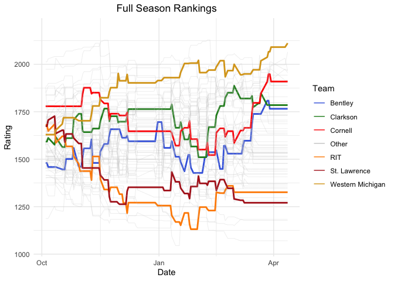

# Analyzing Elo Ratings For NCAA Men’s Division 1 Hockey
Alex Tidd

## Introduction

NCAA Men’s Division 1 Ice Hockey has 64 teams. This inherently makes
ranking teams extremely hard. It is impossible to rank teams in the same
manner as pro leagues like the NHL and junior leagues like the 3 CHL
leagues, where teams are ranked based off of a record-point system. This
is due to the fact that many teams end up with similar records, but with
a league so large and full of different conferences, the strength of a
victory/loss is not the same for every game. This project aims to solve
the issue presented by using a ratings system used in chess to
accurately rate and rank players, called Elo, for use in collegiate
hockey.

## Data

The data used for this project comes from College Hockey News
https://www.collegehockeynews.com/schedules/. The data contains the
entire 2023-2024 and 2024-2025 NCAA Men’s Division 1 Hockey schedules.
The variables included in the data are: date, game_type, away_team,
away_score, home_team, home_score, overtime, neutral_site, score_diff,
and outcome. The score_diff and outcome variables are in reference to
the home team, with outcome being either 1: win, 0.5: tie, or 0: loss.

``` r
schedule2324 |> slice(1:4)
```

    # A tibble: 4 × 10
      date       game_type      away_team   away_score home_team home_score overtime
      <date>     <chr>          <chr>            <dbl> <chr>          <dbl> <lgl>   
    1 2023-10-07 Non-Conference Lake Super…          2 Michigan…          5 FALSE   
    2 2023-10-07 Non-Conference Mass.-Lowe…          2 Alaska-A…          3 TRUE    
    3 2023-10-07 Non-Conference Denver               7 Alaska             3 FALSE   
    4 2023-10-07 Non-Conference Lindenwood           1 Air Force          4 FALSE   
    # ℹ 3 more variables: neutral_site <lgl>, score_diff <dbl>, outcome <dbl>

``` r
schedule |> slice(1:4)
```

    # A tibble: 4 × 10
      date       game_type      away_team   away_score home_team home_score overtime
      <date>     <chr>          <chr>            <dbl> <chr>          <dbl> <lgl>   
    1 2024-10-04 Non-Conference Michigan S…          2 Lake Sup…          1 TRUE    
    2 2024-10-04 Non-Conference Minnesota …          5 Michigan           2 FALSE   
    3 2024-10-04 Non-Conference Arizona St…          8 Air Force          1 FALSE   
    4 2024-10-04 Non-Conference Bowling Gr…          2 Mercyhur…          1 FALSE   
    # ℹ 3 more variables: neutral_site <lgl>, score_diff <dbl>, outcome <dbl>

## Elo Model

The original Elo model used for chess is shown below:

$$E_a = \frac{1}{1 + 10^{\frac{R_b - R_a}{400}}}$$

Where:

- $E_a$ is the player’s expected outcome (Palyer A’s win probability).

- $R_a$ is the player’s pregame rating.

- $R_b$ is the opponent’s pregame rating.

To update the rating after the match is played, the update equation is:

$$R^{\prime}_a = R_a + k(\text{outcome} - E_a)$$

Where:

- $R^{\prime}_a$ is the player’s postgame rating.

- $R_a$ is the player’s pregame rating

- $k$ is an update factor that scales the amount of points a player
  changes by.

- $\text{outcome}$ is the outcome of the match, 1 for a win, 0 for a
  loss.

- $E_a$ is the player’s expected outcome. In other words, the
  probability that Player A wins.

For our model to rate and rank NCAA Men’s Division 1 Hockey, we add in a
goal differential factor, $d$, a home-ice advantage factor
$\text{homeIce}$, and optimized update factor, $k$, for hockey. The
model is shown below:

$$E_{home} = \frac{1}{1 + 10^{\frac{R_{away} - (R_{home} + \text{homeIce})}{400}}}$$

$$E_{away} = \frac{1}{1 + 10^{\frac{(R_{home} + \text{homeIce}) - R_{away}}{400}}}$$
Where:

- $E_{home}$ is the expected outcome of the home team (win probability).

- $E_{away}$ is the expected outcome of the away team (win probability).

- $R_{home}$ is the pregame rating of the home team.

- $R_{away}$ is the pregame rating of the away team.

- $\text{homeIce}$ is the home ice advantage factor.

To update the ratings after the game, the equation below is used:

$$R^{\prime}_{home} = R_{home} + k(((0.6686\cdot ln(\text{scoreDiff}))+0.8048)(\text{outcome} - E_{home}))$$

$$R^{\prime}_{away} = R_{away} + k(((0.6686\cdot ln(\text{scoreDiff}))+0.8048)(\text{outcome} - E_{away}))$$

Where:

- $R^{\prime}_{home}$ is the post game rating of the home team.

- $R^{\prime}_{away}$ is the post game rating of the away team.

- $R_{home}$ is the pregame rating of the home team.

- $R_{away}$ is the pregame rating of the away team.

- $k$ is the update factor, scaling the amount of points a team gains
  from a win or loss.

- $((0.6686\cdot ln(\text{scoreDiff}))$ is the goal differential factor,
  $d$.

- $\text{scoreDiff}$ is the score differential in relation to the home
  team.

- $\text{outcome}$ is the outcome of a game, 1 for a win, 0.5 for a tie,
  0, for a loss.

- $E_{home}$ is the expected outcome of the home team.

- $E_{away}$ is the expected outcome of the away team.

To find values for $k$ and $\text{homeIce}$, a grid search technique was
used to optimize $k$ and $\text{homeIce}$ in order to minimize the mean
absolute value of $\text{outcome} - E_{home}$ for the entire season.
Goal differential factor, $d$, was found using the goal differential
factor in FiveThirtyEight’s NHL Elo model,
<https://fivethirtyeight.com/methodology/how-our-nhl-predictions-work/>.

## Results

The full ratings from the 2024-2025 season using our model is shown
below. Teams are highlighted based off of performance during the season
(Western Michigan, NCAA Champions), relation to St. Lawrence University
(Clarskon University and Cornell University), and personal connection
(RIT, and Bentley University).




The above plot bins every game of the 2024-2025 season into $E_{home}$
of every 0.1. The binned $E_{home}$ is then plotted against the
proportion of games won in every bin. We expect to see a slope of 1,
meaning that for example: for all games where $E_{home}$ was between 0.9
and 1, the home team won 90% of the games. The fitted model is:
$\hat{p}_{win} = 1.24411\hat{expected}_{binned} - 1.24411$.

## Interpretation

- Model reduces mean absolute value of residual to 0.388.
- Model takes into consideration consistent winning, strength of
  opponent, home ice advantage and score differential to determine
  ratings.
- Model shows that roughly the proportion of all wins within a binned
  expected outcome is equal to that expected outcome.

## Future work

Future research into Elo for Men’s NCAA Division 1 Hockey would include
optimizing $d$ instead od relying on others’ model, and weighing goals
for and goals against separately to look into wheteher strong defense or
strong offense is a better indicator of teams’ success.
